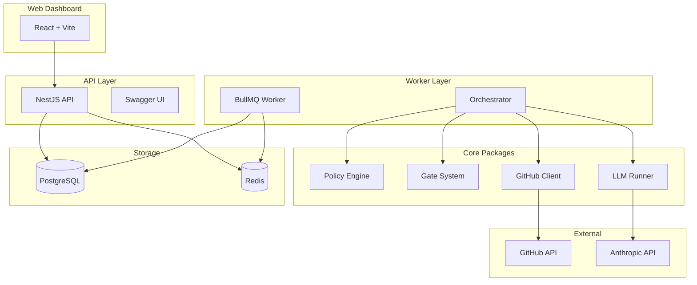
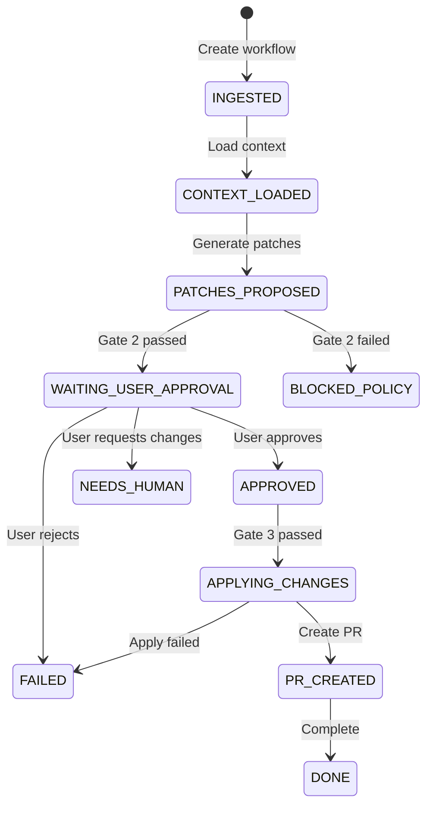

# arch-orchestrator

A policy-, gate-, and approval-driven workflow engine for AI-assisted code changes.

## Overview

arch-orchestrator is a workflow engine that manages AI-proposed code changes through a structured approval process. It ensures that no code modifications reach your repository without explicit human approval, policy validation, and audit trails.

### Key Features

- **Safety-first design**: All GitHub writes are gated behind explicit approvals
- **Policy engine**: Configurable rules to block forbidden file patterns, limit diff sizes, and enforce security policies
- **Multi-gate system**: Three layers of validation (Gate 1, 2, 3) before any code is applied
- **Full audit trail**: Every action is recorded with cryptographic context hashing
- **Web dashboard**: React-based UI for reviewing and approving changes
- **Checkpoint/recovery**: Resume workflows from any point after failures

## Architecture



### Workflow States



## Quick Start

### Prerequisites

- Node.js 20+
- PostgreSQL 15+
- Redis 7+
- GitHub account with OAuth app (for dashboard auth)
- Anthropic API key (for LLM features)

### Setup

1. Clone the repository:
   ```bash
   git clone https://github.com/your-org/arch-orchestrator.git
   cd arch-orchestrator
   ```

2. Install dependencies:
   ```bash
   npm install
   ```

3. Configure environment variables:
   ```bash
   cp .env.example .env
   # Edit .env with your values
   ```

4. Run database migrations:
   ```bash
   npx prisma migrate deploy
   npx prisma generate
   ```

5. Start the services:
   ```bash
   # Terminal 1: API
   npm run start:api

   # Terminal 2: Worker
   npm run start:worker

   # Terminal 3: Web Dashboard (development)
   npm run start:web
   ```

6. Open the dashboard at http://localhost:5173

### API Documentation

Swagger UI is available at http://localhost:3000/api/docs when the API is running.

## Project Structure

```
arch-orchestrator/
├── apps/
│   ├── api/          # NestJS REST API
│   ├── worker/       # BullMQ background worker
│   └── web/          # React + Vite dashboard
├── packages/
│   ├── core/         # Shared business logic
│   └── db/           # Prisma client and types
├── prisma/
│   └── schema.prisma # Database schema
└── test/
    ├── unit/         # Unit tests
    └── invariant/    # Safety invariant tests
```

## Environment Variables

| Variable | Description | Required |
|----------|-------------|----------|
| `DATABASE_URL` | PostgreSQL connection string | Yes |
| `REDIS_URL` | Redis connection string | Yes |
| `GITHUB_TOKEN` | GitHub personal access token | Yes |
| `GITHUB_CLIENT_ID` | GitHub OAuth app client ID | For auth |
| `GITHUB_CLIENT_SECRET` | GitHub OAuth app secret | For auth |
| `ALLOWED_GITHUB_USERS` | Comma-separated list of allowed usernames | For auth |
| `JWT_SECRET` | Secret for JWT token signing | For auth |
| `ANTHROPIC_API_KEY` | Anthropic API key for Claude | For LLM |
| `CORS_ORIGINS` | Allowed origins for CORS | Optional |
| `FRONTEND_URL` | Frontend URL for OAuth callback | Optional |

See [Environment Variables](docs/ENV.md) for detailed documentation.

## Testing

```bash
# Run all tests
npm test

# Run with coverage
npm run test:coverage

# Run specific test file
npx jest test/unit/transition.spec.ts
```

## Development

```bash
# Type checking
npm run typecheck

# Linting
npm run lint

# Build all packages
npm run build

# Generate OpenAPI spec
npm run generate:openapi --workspace=apps/api
```

## Deployment

The project includes Railway deployment configurations:

- `apps/api/railway.toml` - API service
- `apps/worker/railway.toml` - Worker service
- `apps/web/railway.toml` - Web dashboard

See individual app READMEs for deployment details.

## License

MIT

## Contributing

1. Fork the repository
2. Create a feature branch
3. Make your changes
4. Run tests
5. Submit a pull request

All contributions go through the same approval workflow that arch-orchestrator manages.
