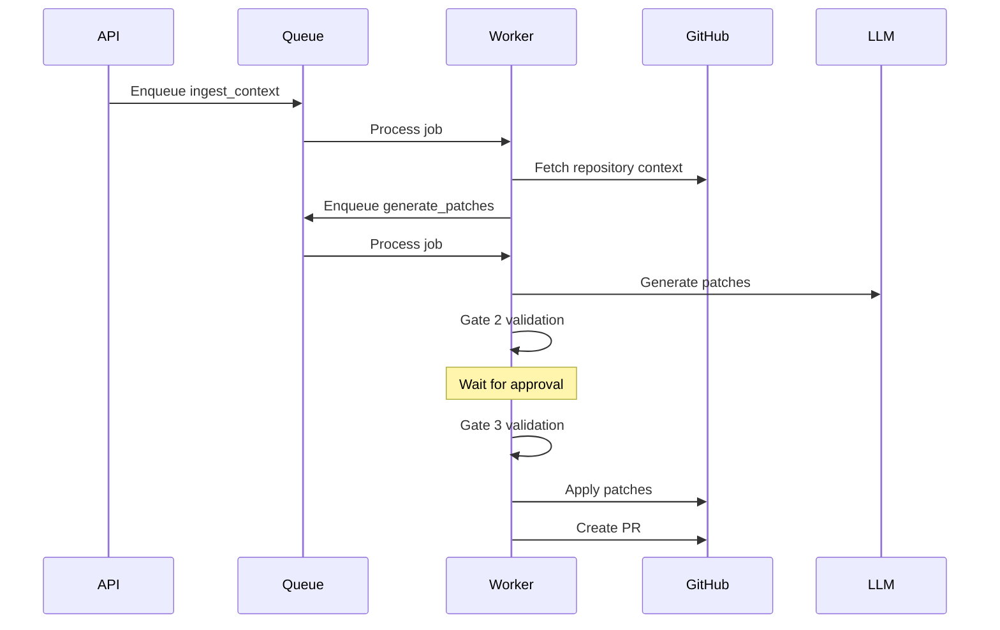

# arch-orchestrator Worker

BullMQ background worker for the arch-orchestrator workflow engine.

## Overview

The worker processes background jobs including:

- Context loading and parsing
- LLM-based patch generation
- Policy validation (Gate 2)
- Patch application (Gate 3)
- Pull request creation
- Self-diagnosis and recovery

## Job Types

### workflow

Main workflow processing queue with job types:

- `ingest_context` - Load repository context
- `generate_patches` - Generate patches via LLM
- `apply_patches` - Apply approved patches
- `create_pr` - Create pull request

### Processors

- `IngestContextProcessor` - Loads files and context from GitHub
- `GeneratePatchesProcessor` - Runs LLM to generate patches
- `ApplyPatchesProcessor` - Applies patches to repository
- `OrchestratorService` - Main orchestration logic

## Development

```bash
# Start in development mode
npm run start:dev

# Build
npm run build

# Start production
npm run start
```

## Environment Variables

| Variable | Description | Default |
|----------|-------------|---------|
| `DATABASE_URL` | PostgreSQL URL | Required |
| `REDIS_URL` | Redis URL | `redis://localhost:6379` |
| `GITHUB_TOKEN` | GitHub personal access token | Required |
| `ANTHROPIC_API_KEY` | Anthropic API key | Required for LLM |
| `LLM_MODEL` | Claude model to use | `claude-sonnet-4-20250514` |
| `LLM_MAX_TOKENS` | Max tokens per request | `4096` |

## Orchestration Flow



## Deployment

### Railway

Configure as a separate service:

```toml
[build]
builder = "nixpacks"

[deploy]
# Worker has no health check endpoint
restartPolicyType = "on_failure"
```

Set environment variables in Railway dashboard.

## License

MIT
